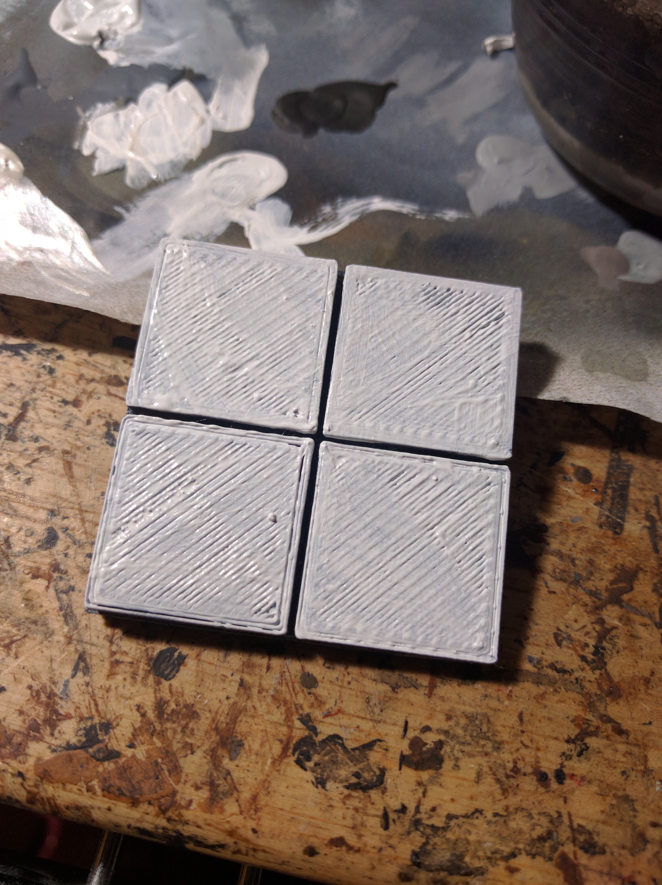
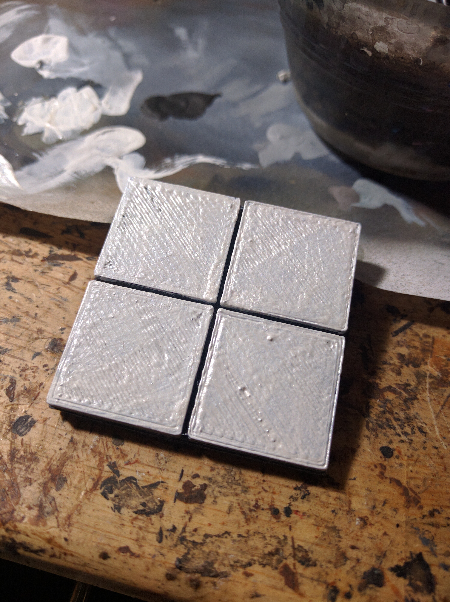
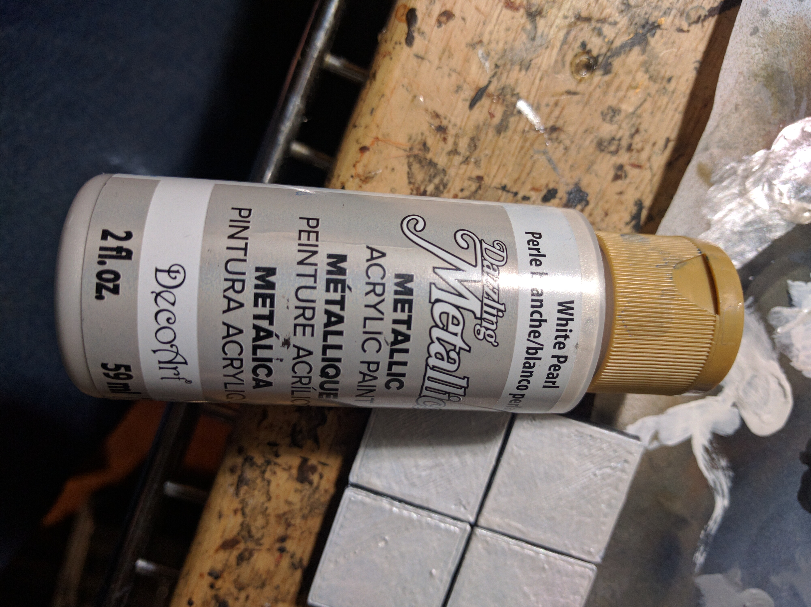
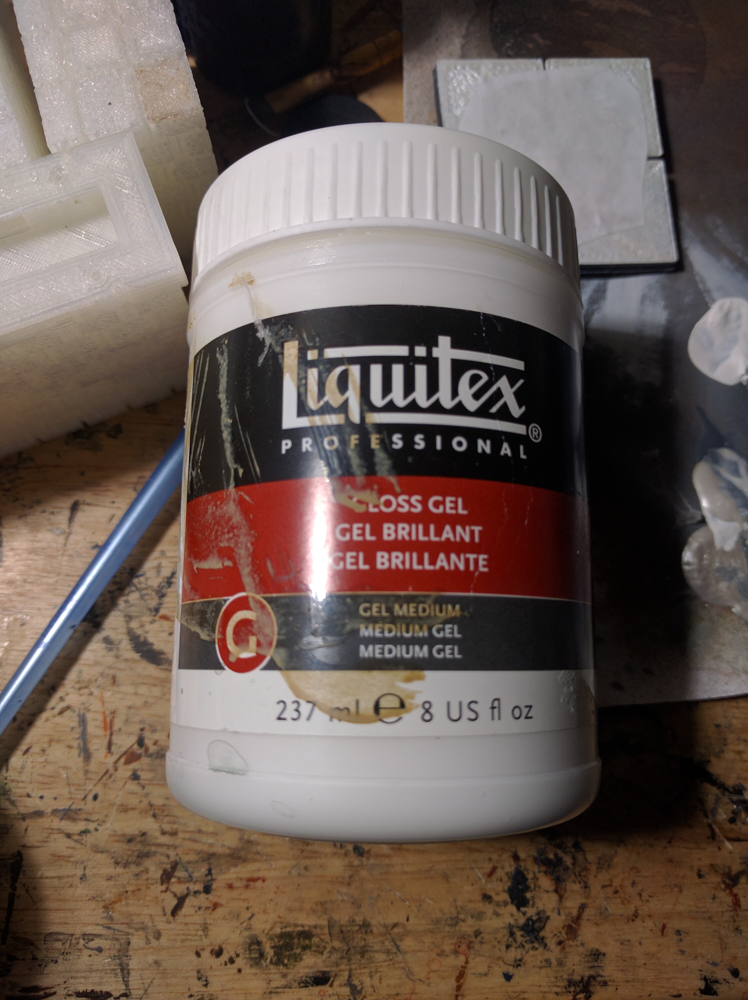
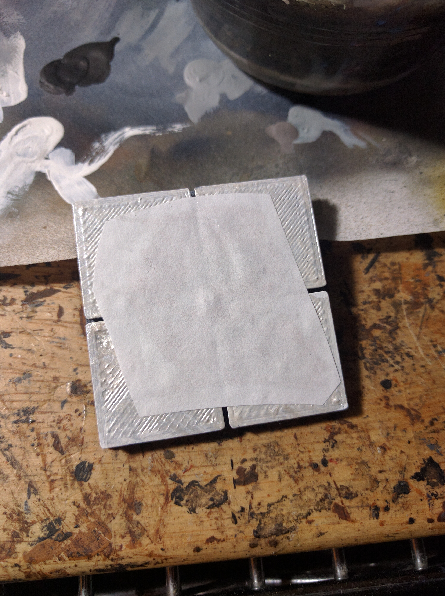
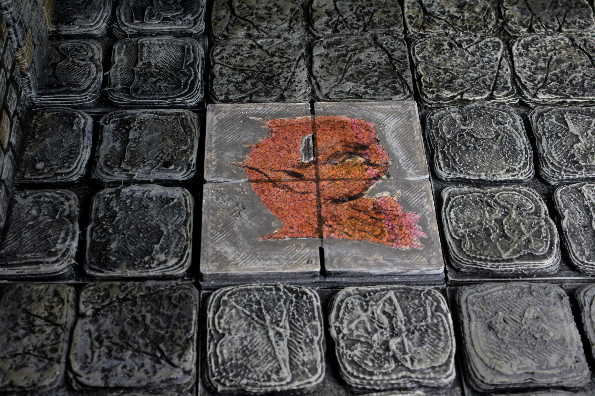

# Mosaic / Image Transfer Tile Guide
[Up to other guides](../README.md)

# Supplies
* [Krylon Fusion](http://amzn.to/2C8XG0L) Flat Black Camo Primer (or other black primer)
* [Snow (Titanium) White](https://decoart.com/Merchant2/merchant.mvc?Session_ID=9dfbaac54a360cee1f9f4ea541267a45&Screen=PROD&Store_Code=D&Product_Code=DAO1-3&Category_Code=DA-2)
* [Metallic White Pearl](https://decoart.com/Merchant2/merchant.mvc?Session_ID=9dfbaac54a360cee1f9f4ea541267a45&Screen=PROD&Store_Code=D&Product_Code=DA117-3&Category_Code=)
* Laser Printer
* Images to print (Find some nice public domain images that can be mosaics [here](https://www.thingiverse.com/thing:2063860))
* Paper
* [Liquitex Gloss Gel Medium](http://amzn.to/2BvZYdR)
* Water

## Tile preparation

Most of these images are sized for 2x2 tiles. I've included here 2x2, 4x2 & 4x4 tiles for both OpenForge 2.0 internal/external tiles and OpenForge OpenLOCK tiles.

Print the tile, and then give it a basic paint job. I do a very quick paint using 3 spray paints. Don't feel a need to do it this way, this is just how I quickly bang out a lot of tile painting for stone tiles.

1) Use a flat black primer spraypaint to cover all surfaces of the tile. Try to get in the cracks. Let the tile dry.
1) Use the flat black primer spraypaint for a second coat to ensure a good black background. Let the tile dry.
1) Use a flat grey primer spraypaint. Hold it at a 45 degree angle, at least a foot and a half from the tile, and use short bursts to get the basic color in place, while leaving black in the cracks and in the shadows, turning the tile around to get it from 360 degrees.
1) Use a flat white primer spraypaint. Hold it at an 80 degree angle. Use very short bursts to highlight the top edges.

Paint the square surfaces on the tile with white paint, doing as many layers as it takes for it to be a good solid white. Just like printing on paper where images will be more brilliant based on the brightness of the paper, the whiteness of the surface you attach the image to will impact it's brilliance.

For the same reasons I make the tile surface bright white, I add a layer of metallic white, which is very reflective to add a sparkle to the lighter parts of the image.

### Print the image

Print the image you want to affix from the mosaic.zip on a laser printer. It's CRITICAL that the printing be done on a laser printer. Ink on an inkjet soaks into the paper. Laser toner is itself a polymer that is baked onto the surface of the paper. Using the right techniques, we can transfer that toner from the paper to the tile.

All of the included images are in 300 dpi. Print them using your favorite image printing software, ensuring that it's done at 300 dpi. Janus, Asmodeus, the Mermaid and the small version of Plenty are all designed for a 2x2 tile. The Heirophant for 4x2 and the large version of plenty for 4x4.

Cut the image out of the paper. Some of the images are designed to be centered (Asmodeus and the Mermaid), the rest are designed with a border larger then the tile to make sure it reaches to the edges.

### Apply the image to the tile

You will need to get a polymer that can hold onto the toner as the paper is removed. The best I'm aware of is using a gel medium. For example, Liquitex Gloss or Matte Gel. You can also use Mod-Podge, but it's slightly more prone to failure.

Glue the image down, making sure the medium is well spread over all of the image area you want to transfer. For the edge to edge images, I even applied some medium directly to the tile to make sure it got into all the cracks or holes left by the 3d printing process. You will want to press down as you apply, being sure to make sure there is good contact for the image everywhere. Any place that doesn't glue down well could be accidentally removed in the final steps. Let the medium harden for at least an hour. Overnight is even better.

### Find the image

When the medium is dry and hard, take some water, and spritz it on the back of the tile. you will start to see the image through the wet paper. Take your thumb and lightly rub. The fibers from the paper will start to come up and bead. Apply more water, and gently rub until you get all the paper you can see off. Let dry, and you will see that the image becomes somewhat foggy. This is because it's nearly impossible to get all the paper fibers the first time around. Apply more water and lightly rub in circles. I found rubbing it against my tee shirt managed to get the smaller pills of paper off well. You don't need to be perfect getting every bit of fiber off. The final step will help hide remaining fibers.

### Protect the image

After you have let the tile dry, wet it slightly again, and then put a layer of the medium on top. This will both help to brighten the image as well as to protect it from gameplay.

### Oops!

So you rubbed off some of the image eh? Well, this happens. Expect to attempt each tile a few times before getting a perfect one. The good news? just because the image is damaged doesn't mean it can't be usable. If you look at pictures of ancient mosaics, nearly all of them are broken and show the mortar in places. Paint the area that came off with dark grey paint, and line the edges with white or light grey to make the image look like the mosaic was damaged.

You can see in the upper left quadrant, the image was damaged, so I painted it to look like the mosaic itself was damaged.

[Up to other guides](../README.md)

