Table of Contents
=================

   * [Miniature Painting Paint Selection](#miniature-painting-paint-selection)
      * [Prices](#prices)
   * [Paints](#paints)
      * [Army Painter](#army-painter)
      * [Citadel](#citadel)
      * [Formula P3](#formula-p3)
      * [Reaper Master Series](#reaper-master-series)
      * [Reaper MSP HD](#reaper-msp-hd)
      * [Scale 75 Fantasy and Games](#scale-75-fantasy-and-games)
      * [Vallejo Game Color](#vallejo-game-color)
      * [Warcolours](#warcolours)
      * [Other paint lines](#other-paint-lines)
   * [Metallics](#metallics)
      * [Vallejo Metal Color](#vallejo-metal-color)
      * [Badger Metalsmith](#badger-metalsmith)
      * [Vallejo Liquid Gold](#vallejo-liquid-gold)
      * [Other Metal Paints](#other-metal-paints)
   * [Washes](#washes)
      * [Army Painter Quickshade](#army-painter-quickshade)
      * [Army Painter Quickshade Washes](#army-painter-quickshade-washes)
      * [Citadel Shades](#citadel-shades)
      * [Green Stuff World Washes](#green-stuff-world-washes)
      * [Oil Washes](#oil-washes)
      * [Reaper Master Series Washes](#reaper-master-series-washes)
      * [Tamiya Panel Line Accent Colors](#tamiya-panel-line-accent-colors)
      * [Vallejo Game Color Washes](#vallejo-game-color-washes)
      * [Vallejo Model Wash](#vallejo-model-wash)
      * [Warcolours Shades](#warcolours-shades)
      * [Other Wash lines](#other-wash-lines)

Created by [gh-md-toc](https://github.com/ekalinin/github-markdown-toc)

# Miniature Painting Paint Selection

# A Note About Craft Paints

Many people try craft paints (Americana, Folk Art, Craft Smart, etc) as their first paint to paint miniatures.  A person can achieve tabletop quality with craft paints, but they will do it having to fight the paints, instead of the paints making the job easier for them.  Miniature paints are designed to make easy techniques easy and hard techniques possible.  Craft paints are designed for straightforward techniques and low price.  The primary problems with using craft paint is that they have two problems for miniatures:

1) their pigment is not ground as finely as model paints
2) They are not very pigment dense

What this means in practice is that as soon as you use anything but the most basic techniques for miniature painting, you will start to run into the limitations of this paint.  As you thin it, the low pigment density will result in the paint turning glossy and having inconsistent coverage.  The less fine pigment will mean you will have a harder time painting details and not clogging them.  You'll also find that it's much harder to avoid brush strokes.  Beyond the two larger problems, the medium for craft paints is missing additives that most miniature paints have that increase the drying time and improve their flow.

If you are doing your painting of miniatures with the basic techniques of base coat + wash + drybrush, you can get by with them, but as soon as you start trying to do layering, wet blending, feathering, etc, the paints are going to fight you every step of the way.

I personally use a ton of craft paint, mostly for painting 3d printed terrain, so it's not a distain for craft paints, they are a useful tool in the crafter's arsenel, but they also have specific applications where they are better, and applications where they are suboptimal.  For painting miniatures, craft paints have significant drawbacks.  For painting large structures where your primary focus is on techniques like base coating, overbrushing, washing and drybrushing, craft paints are a much much cheaper alternative for painting large pieces where you don't have a need to use more advanced techniques.

References:

* [Luke's APS: Make craft paints work on your minis and terrain.](https://www.youtube.com/watch?v=xsQlKepVQE0)

## Prices

Here's your prices (All taken from miniature market's "Retail Price" except warcolours since they are only sold through their website):

* Warcolours: 15ml dropper for 1.95€ &#126; $2.19 ($0.15/ml)
* Army Painter Paint: 18ml dropper bottle for $2.99 ($0.17/ml)
* Vallejo Paint: 17ml dropper bottle for $3.29 ($0.19/ml)
* Reaper MSP: 1/2 oz (15 ml) for $3.29 ($0.22/ml)
* P3: 18ml paint pot for $4.00 ($0.22/ml)
* Scale 75 Paint: 17ml dropper bottle for $4.49 ($0.26/ml)
* Citadel GW Paint: 12ml paint pot for $4.55 ($0.38/ml)

Based purely on pigment density, Citadel should be selling much closer to 17 cents per ml, but instead it's the most expensive at 38 cents.  Warcolours on the other hand is the cheapest with one of the best pigment densities.

# Paints
(Note, all links and prices last updated on 2019/06/03)

My initial advice is pick a paint set, and use that for the backbone of your collection.  Once you are well grounded in painting, you can start to explore other lines.  Every line has some colors that they excel at and some colors that just suck.  

My bottom line recommendation:

* If you want the best all in one paint set, my recommendation here is to go with a vallejo game color basic set.  I can also highly recommend the reaper master paints set 1.
* If you are looking to get into painting on the cheap, you can't go wrong with army painter's sets.  As your skill grows, you can explore other sets, and add in some paint here or there.  Army painter will still be solid for you as a foundation.  You'll just need other paints when you want to explor glazing.
* If you are more experienced, you probably don't need my advice, but as a second set of paints for more advanced techniques I can strongly recommend Warcolours' layer paint set.

Finally, metallics are an exception to all of the review below.  Check the metallics section below the paint section for my metallics recommendation.

References:

* [Dr Faust's Painting Clinic: Picking Your Paint - What's the Best Paint for You?](https://www.youtube.com/watch?v=XXoWsMlsjTM)
* [Miniac: BEST Beginner Paint Set?!](https://www.youtube.com/watch?v=jrJ1Yb2QI1g)
* [Vince Venturella: Hobby Cheating 80 - Miniature Paint Brand Guide](https://www.youtube.com/watch?v=et6VmcFJpXU)

## Army Painter

* Pigment Density: Low
* Container: 18ml Dropper
* Cost per ml: $0.17/ml ($2.99 per dropper bottle)
* Personal level of experience: Medium
* Purchase starting place: [Warpaints Starter Set](https://amzn.to/2QJdyA8) (9 paints, 1 wash, 1 brush for $24.20) to try them out.  You can also get the [Mega Paint Set](https://amzn.to/2Kljnm5) (46 paints, 2 washes, 1 brush for $98.54) to get a big range or the [Wargamers Complete Paint Set](https://amzn.to/2KmXrHe) (113 paints, 11 washes, 5 brushes for $229.98) to get their full range.
* Finish: Satin

Army Painter is a good alternative to citadel.  They are very similar paints with a similar composition, but are WAY cheaper.  They are be good for layering, but like citadel will be hard to glaze with.

Like Vallejo and Warcolours, Army Painter does not sell a line of miniatures, they sell paint and painting accessories.  This is nice because it limits the degree to which they are beholden to the needs of their miniature lines.  They do however have D&D and CMON licenses.

## Citadel

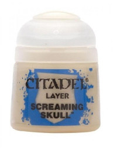

* Pigment Density: Low
* Container: 12ml Paint Pot
* Cost per ml: $0.38/ml ($4.55 per paint pot)
* Personal level of experience: Low
* Purchase starting place: [Citadel Base Paint Set](https://amzn.to/2IkBaqD) (11 paints, 1 brush for $40.08) to try them out. For a few more paints, you can get the [Citadel Layer Paint Set](https://amzn.to/2KpxNBB) (20 paints, 1 brush for $66.56)
* Finish: Satin

Citadel has significant drawbacks. First it comes in paint pots, which means you will waste or ruin more paint from drying out than brands that come in dropper bottles. Second, per ounce it's one of the most expensive paints on the market. Third, citadel has one of the lowest pigment densities of any of the major miniature paint brands.  This means when you thin it, it will break faster than other paints.  It also means that it is more likely to go on gloppy.

## Formula P3

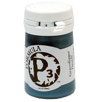

* Pigment Density: ?
* Container: 18ml Paint Pot
* Cost per ml: $0.22/ml ($4 per paint pot)
* Personal level of experience: None
* Purchase starting place: P3 has numerous sets, but the sets are all designed around factions from the Warmachine/Hordes miniatures wargame.  No single set is good for a beginner painter, but if you play the game, they can give you much of what you need to paint a faction.
* Finish: Satin

I don't actually have experience with P3.  It is well considered by many other painters.  They tout that they use liquid pigment, which makes it harder for their paint to break, but I have no idea how effective this is.  P3 does come in paint pots, which I personally do not like.  I would probably be more inclined to try them if they came in dropper bottles.

## Reaper Master Series

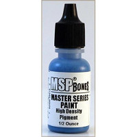

* Pigment Density: Medium
* Container: 15ml Dropper
* Cost per ml: $0.22/ml ($3.29 per dropper bottle)
* Personal level of experience: High
* Purchase starting place: [Learn To Paint Kit: Core Skills](https://amzn.to/2IeODAu) or [Learn To Paint Kit: Layer Up](https://amzn.to/2Ie86RP) (11 paints, 2 brushes, 3 miniatures) to get a sample of how they work, [Master Series Paint Bones Colors Full Set](https://amzn.to/2KoEBiX) (54 paints for $126.54) to get a larger range, or [Reaper Master Series Paint Set 1](https://amzn.to/2IeEZxR) (108 paints for $264.95) to get a significant range.
* Finish: Matte/Satin

Reaper is one of my favorites specifically for layering.  The master series sells paints in triads, which is a shadow, midtone and highlight intended for some purpose.  They sell skin triads, wood triads, verdigris triads, etc.  Reaper has a pigment density similar to vallejo.  Reaper comes pre thinned.  It's formulation has a fair amount of flow improver in it, so they are superb for layering, and thin well for glazing, and work great for wet blending.   However, they can be a bit harder to feather and dry brush with.

I personally think Reaper paints are the most comparable to Vallejo.  Like Vallejo they are a good backbone for your paint collection.  The triad concept is super useful for newer painters, but I still use the triads almost every time I paint because they help make some decisions just easier.

## Reaper MSP HD

* Pigment Density: High
* Container: 15ml Dropper
* Cost per ml: $0.22/ml ($3.29 per dropper bottle)
* Personal level of experience: Medium
* Finish: Matte/Satin

The Reaper HD line uses a higher density pigment, and a different medium than the rest of the master series paints.  This line has been discontinued, and ceased production in 2018.  You can still find them, but they are no longer being bottled.

## Scale 75 Fantasy and Games

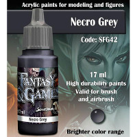

* Pigment Density: High
* Container: 17ml Dropper
* Cost per ml: $0.26/ml ($4.49 per dropper bottle)
* Personal level of experience: Low
* Purchase starting place: Scale 75 has many sets that cover a color range such as the [Blue Sky Paint Set](https://amzn.to/2Wjc2ug), [Green Paint Set](https://amzn.to/2Kl348I) or the [Blood and Fire Paint Set](https://amzn.to/2WaFWft).  (8 paints for ~ $30) Any of these would be a good place to try them out.  For a larger set, they offer the [Fantasy & Games Collection](https://amzn.to/2WeRe25) (48 paints for $195) or the [Scalecolor Collection](https://amzn.to/2MrkV0g) (63 paints for $235)
* Finish: Ultra matte

Scale 75 is great paint, but it's one of the hardest to use, due to using a different medium formulation than most paints.  Scale 75 is designed for more for advanced techniques.  They excel at wet blending, two brush blending and glazing.  Like Warcolours, you can also thin them to layer paint.  Scale 75 paints are ultra matte, so they also excel at tasks suited towards competition painters.  Competition painters generally do not varnish, but as most paints have a satin finish, they need to be hit with a matte varnish to knock down the shine.  Scale 75 does not suffer this.  Starting out, you are probably better focusing on layer paints, as layering is generally the first skill to pick up in painting.

References:

* [Vince Venturella: Product Review 12 - Scale 75 Blue Paint Set](https://www.youtube.com/watch?v=iBglxdOvcGM)
* [Vince Venturella: Product Review 14 - Scale 75 Flesh Paint Set](https://www.youtube.com/watch?v=HRRA0ZV72xs)

## Vallejo Game Color

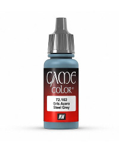

* Pigment Density: Medium
* Container: 17ml Dropper
* Cost per ml: $0.19/ml ($3.29 per dropper bottle)
* Personal level of experience: Medium
* Purchase starting place: [Game Color Intro Set](https://amzn.to/2IgMPH9) (16 paints for $39.40) or the [Game Color Basic Paint Set](https://amzn.to/2Wmcbxg) (72 paints, 3 brushes for $216.88)
* Finish: Satin

Vallejo is probably the most expansive line.  They have tons of great colors, and their paints have a good amount of pigment, so you can still get into the advanced techniques with them.  Vallejo sells multiple lines designed for different audiences, such as model color and mecha color.  There's no material difference in the game color, model color and mecha color lines as far as the paint formulation, so you can use them interchangeably.  Game color gives a broad range of colors, both saturated and unsaturated.  It is probably the most flexible of the lines. Model color focuses more on a huge panel desaturated of browns, greens and greys that fit in for say WWII vehicles.  Mecha color is focused on highly saturated primary colors to fit with the anime mecha asthetic.  Vallejo paints are fantastic layer paints.  They can be thined a great deal, so can be used as glazes and will also work well for wet blending.  Vallejo paints are basically a workhorse that make a great backbone of your paint collection.

Vallejo has a significant advantage over many of the other paint lines.  Vallejo started as a company producing paints for historical models.  Because of this, they started from day one focused on consistently year after year producing very precise and consistent colors.  Vallejo also sells no games or models, so they are only in the business of paint.  The end result is that the only way they make money is by producing the best paint they can.

Finally, as a personal point of irritation, I hear the name of these paints regularly abused.  Vallejo is a spanish company, so the proper pronunciation is not *"Va-Leh-ho"*, it is *"Vah-YEH-ho"*.  This is similar to how tortilla is pronounced. 

## Warcolours

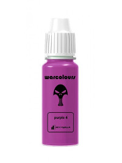

* Pigment Density: High
* Container: 15ml Dropper
* Cost per ml: $0.15/ml (1.95€ per dropper bottle)
* Personal level of experience: High
* Purchase starting place: Go with a [single color layer paint set](https://www.warcolours.com/index.php?route=product/product&path=60&product_id=65) (7 paints for 14.95€ &#126;= $16.79) to try them out, or get their [full layer paint set]() (92 paints for 164.95€ &#126;= $185.30)
* Finish: Matte

Warcolours are a cheaper alternative to Scale 75 and mostly functions the same way.  They come in 5 color sets from the darkest to the brightest for the color (say like red).  I love my warcolours, but like Scale 75, they are not a good place to start.  Warcolours have a gel medium, which makes them surpurb for wet blending.  They have a high pigment density, so they can be thinned easily to make glazes.  If you thin them a bit less, they can do very well as layer paints.  Unless you are wet blending, they *will* need to be thinned, which is what makes them less appropriate for beginner painters.

Like Army Painter and Vallejo, Warcolours does not sell a line of miniatures, they sell paint and painting accessories.  This is nice because it limits the degree to which they are beholden to the needs of their miniature lines.  It also means that Warcolours paints don't happen to have evocative names, which is kind of refreshing.

References:

* [Vince Venturella: Product Review 15 - Warcolours Matte Paint Set](https://www.youtube.com/watch?v=-p0e_YHuTgI)
* [Vince Venturella: Hobby Cheating 86 - How to Paint with Warcolours](https://www.youtube.com/watch?v=e-ICWnMpnAw)

## Other paint lines

There are a number of other paint lines.  As I learn about them, I'll add them here, and when I can get a chance to play with them, I can add an expanded review above.

* AK Interactive Acrylics
* Badger Minitaire
* Coat d’Arms
* Reaper High Density
* Citadel Base
* Secret Weapon Miniatures
* Green Stuff World

# Metallics

References:

* [Miniac: What to Thin Metallics With?](https://www.youtube.com/watch?v=_OGFJst94Lw)
* [Miniac: What's the Best Undercoat for Metal?](https://www.youtube.com/watch?v=Iaca4TlvuC8)

## Vallejo Metal Color

* Pigment Density: High
* Container: 32ml Dropper
* Cost per ml: $0.26/ml ($8.40 dropper bottle)
* Personal level of experience: High
* Finish: Metallic

Unfortunatly, nearly all acrylic metal paints are fairly bad.  The pigments can't be ground as fine, so they tend to be really gloppy and are hard to get good results with.  There is one exception to this: Vallejo Metal Color (VMC) (not to be confused with metal paints in the game or model color lines, and not to be confused with vallejo metallics).  These metal paints are a joy to work with.  They start of already very thin, and have fantastic coverage.  I don't know what black magic Vallejo is doing with this, but they are incredible.  I basically don't use any of my other metallic paints anymore.  Don't bother with anything else.

The only real downside in them is that they only have two non 'silver' based colors, gold and copper. that being said, you can make a great bronze by mixing those two.
For a starter of vallejo metal color, I would recommend:

* Gold
* Copper
* Pale Burnt Metal (which can be used as a highlight for either Gold or Copper)
* Silver (Highlight)
* Steel (Midtone)
* Magnesium (Shadow)

Those 6 are probably all the metal colors you'll ever need. They are more expensive per pot than most paints at $8.40, but are also much larger at 32ml (so $0.26/ml).

References:

* [Vince Venturella: Product Review 01 - Vallejo Acrylic Metal Color](https://www.youtube.com/watch?v=XxODxALYV8o)
* [Vince Venturella: Product Review 06 - Vallejo Metal Color Copper & Gold](https://www.youtube.com/watch?v=hauVrnhIah0)
* [Vince Venturella: Hobby Cheating 104 - Zenithal Speed Painting w True Metals](https://www.youtube.com/watch?v=ByX2jIEmXJM)
* [Vince Venturella: Hobby Cheating 129 - How to Paint Colored Metallics](https://www.youtube.com/watch?v=l9q35BPaBN0)
* [Vince Venturella: Hobby Cheating 130 - How to Paint Antique Green Gold](https://www.youtube.com/watch?v=8RcdJTyDIE4)
* [Vince Venturella: Hobby Cheating 160 - How to Paint True Metallic Bronze](https://www.youtube.com/watch?v=OsueC_ee5-k)
* [Vince Venturella: Hobby Cheating 179 - Shading True Metallic Metals Revisited](https://www.youtube.com/watch?v=T-gyIO3Ncpk)

## Badger Metalsmith

* Pigment Density: High
* Container: 30ml Dropper
* Cost per ml: $0.08/ml ($2.50 dropper bottle)
* Personal level of experience: None
* Finish: Metallic with a bright shine
* Purchase: [Full Metalsmith Set](https://usaairbrushsupply.com/products/1319-bmsk-basic-metalsmith-kit-1oz-30ml) (2 paints, 3 aging bases and 5 "ores" for $26.40) or you can buy the ores individaully

This is a real interesting paint system.  They have a single base paint, it's silver.  Ther are three aging bases that darken the metal and 5 ores that are tints you can add to make the metal into gold, copper, bronze or colored metals.  The ideas is that you can create paint formulas for a specific mmetal you want to achieve.

The metal paint itself is decent, but not in the same league as Vallejo Metal Color.  However, the ores oars of great use.  They offer Gold Ore, Bronze Ore, Copper Ore, Carbon Iron Ore, Blue Ore and Red Ore, and these can either be be mixed into Vallejo Metal Ccolor to tint it, or glazed on top of it.

The same can be said for nearly any line of inks, along with the [Badger Minitare Ghost Tints](https://amzn.to/2W6Pp7u).  Using either mixed in tints like this, or glazing over the top of VMC, you can achieve any of the colored metallics.  Be sure to first learn how to do this over the silvery VMC colors before you try at all over gold or copper.

Given how cheap the ores are (8 cents per ml, wow!), these are an easy buy to justify.

References:

* [Vince Venturella: Product Review 29 Badger Metalsmith Paint System](https://www.youtube.com/watch?v=aLKfTxHuRgk)

## Vallejo Liquid Gold

* Pigment Density: Very High
* Container: 35ml Pot
* Cost per ml: $0.23/ml ($7.99 dropper bottle)
* Personal level of experience: None
* Finish: Metallic with a bright shine
* Purchase: [Vallejo Liquid Metallics Set](https://amzn.to/2KzL7nd) (4 paints fir $17.20)

I have not used these, but these are alchohol paints.  They require that you use Isopropyl Alcohol to thin them, and they dry out super fast.  They will trash brushes, so don't use good brushes with them (frankly don't use good sable brushes with any metallics).  The pigment and the binder will seperate, so you have to shake them with every use, and if you don't store them properly, the pigment and binder will seperate in a way you can't fix.  All that being said, the results from these paints is supposed to be astonishing.  They produce a shine akin to real metal that you just can't get from scrylic paints.

References:

* [Vince Venturella: Produce Review 04 - Vallejo Liquid Gold](https://www.youtube.com/watch?v=K-ePHYeIKlI)

## Other Metal Paints

* Every paint line under paints
* Darkstar molden metals

# Washes

## Army Painter Quickshade

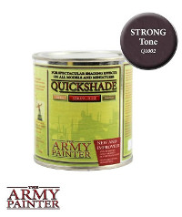

* Container: 250ml Can
* Cost per ml: $0.11/ml ($29.99 per can)
* Personal level of experience: Medium
* Washes in product line: 3
* Purchase: There is no set sold of these, but you can find them individually.  For example here is [Dark Tone](https://amzn.to/2MrFF88) for $23.96

Army Painter Quickshades are a fairly unique product for miniature painting.  They are fairly close in formulation to something like a Minwax wood finish.  They come in three colors: Soft Tone, Strong Tone and Dark Tone.  Dark Tone is a black wash, Strong Tone is a brown wash and Soft Tone is a Sepia Wash (or close to it).  These are intended for super fast army painting, and are a pretty heavy hammer to be hitting with.  They leave a thick gloss coat on your minis, which can be handy for protection, but honestly doesn't look awesome. That can be mitigated through matte varnishes, but still, it leaves the miniature kind of chunky.  This stuff takes about a day to fully dry.  If you plan on using it, expect to have the wash be the last step of your paint job.  I do not recommend these.  Don't confuse these with their line of Army Painter Quickshade Washes, which are quite good.

References:

* [Miniwargaming Jay: Miniature Painting 101: Part 40 - Dips](https://www.youtube.com/watch?v=QbnqzB89CzY)
* [Sorastro's Zombicide: Black Plague Painting Guide Ep.1 - The Zombies](https://www.youtube.com/watch?v=LMOTmOchKyQ)

## Army Painter Quickshade Washes

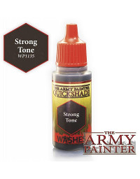

* Container: 18ml Dropper
* Cost per ml: $0.18/ml ($3.25 per dropper bottle)
* Personal level of experience: Medium
* Washes in product line: 11
* Purchase: [Army Painter Quickshade Washes Set](https://amzn.to/2MryqNM) (11 washes for $27.09)

This line of washes should not be confused with the Army Painter Quickshade product line (vs these, Army Painter Quickshade Washes, confusing, I know). This line of washes are very very close in both colors and quality to the Citadel Shades line (With probably 7 of the 11 being direct comparisons).  There are 11 colors, three of which, Soft Tone, Strong Tone and Dark tone ade designed to match up with the Quickshade of the same name.  Thye also have Green Tone, Red Tone, Blue Tone, Purple Tone, Flesh Wash, Mid Brown, Light Tone and Military Shader.

These are good washes, and frankly great for their price.  Oddly my only real complaint is that for washes, my preference reverses and I would prefer to get these in paint pots instead of droppers.  If you are on a budget, these are the go to for washes.  If you are not, you probably still want to have a set of these.

## Citadel Shades

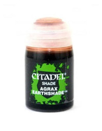

* Container: 24ml Pot
* Cost per ml: $0.33/ml ($7.80 per Pot)
* Personal level of experience: High, None (for gloss washes)
* Washes in product line: 15, 3 of them gloss
* Purchase: [Citadel Shade Paint Set](https://amzn.to/2WKcZv7) (8 shades for $31.32) Warning with this, the pots are smaller, so it's not as good of a deal as it appears.  I would suggest just getting these shades one by one

With as much shade (ha) that I throw at the citadel layer paints, I have to grant that their washes are excellent.  People have referred to them in the past as liquid talent, and they are top notch.  They do a great job of finding recesses, and they dry to a satin, almost matte finish.  You can slop them on, and they will still generally come to a pretty decent result.  The first time you use them, they will feel a little like magic.  I find myself using at least one of Nuln Oil, Agrax Earthshade, Reikland Flesh Shade or Seraphim Sepia on nearly every model I paint.  These are my go to, with Army Painter Quickshade washes being my second most common tool I reach for when it comes to washes.

The citadel line has the following colors: Nuln Oil (Black) (also in Gloss), Agrax Earthshade (Brown) (Also in Gloss), Reilkand Fleshshade (Flesh (Also in Gloss), Seraphim Sepia (Sepia), Athonian Camoshade (green/brown), Drakenhof Niteshade (blue), Druchii Violet (Purple), Biel-tan Green (Green), Carroburg Crimson (dark pink), Fugan Orange (Orange/borwn), Casandira Yellow (Yellow/Orange) and Soelia Greenshade (blue-green).

Given my paint pot hate above, it might seem strange that I prefer this line of washes above others.  Well, shades aren't paints, and if you are going to slop on some wash, it's nice to be able to wick off the excess back into the pot.  Wash pots also don't clog up like paint pots do.  However, what citadel wash orts are famos for is spilling.  If you use these, have a tool to keep the pot upright.  This can be as simple as adding some poster tack to the bottom of the bottle.  Trust me, they are super easy to knock over.

The gloss washes are a fairly new product.  They are supposed to flow better, and work better for washing metals.  I have yet to try them, so I can't speak from experience here.

## Green Stuff World Washes

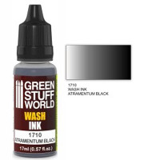

* Container: 17ml Dropper
* Cost per ml: $0.18/ml (2.69€ &#126; $3.03 per dropper)
* Personal level of experience: None
* Washes in product line: 8
* Purchase: [Set x8 Acrylic Wash Ink Paints](http://www.greenstuffworld.com/en/acrylic-inks/781-set-x8-acrylic-wash-ink-paints.html) (8 washes for 21.25€ &#126; $23.92)

Overall I've heard good stuff about these.  My impression is that one of the differences between older washes and the newer generation that seem to be substantially more useful is the transition to inks for the pigment.  The Green Stuff World Washes use ink.

Greenstuff world inks have black, red, blue, flesh, purple, green earth (brown) and sepia.  This is a pretty standard line up.

References:

* [Vince Venturella: Product Review 32 - Green Stuff World Wash](https://www.youtube.com/watch?v=iVzt6ZN-LAQ)

## Oil Washes

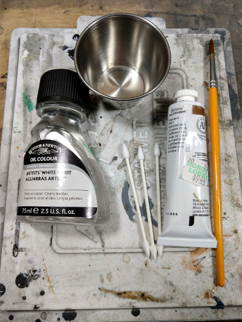

* Container: Any
* Cost per ml: Any
* Personl level of experience: Low

This is more a class of products than any single product.  What you do is you get a traditional oil paint, and thin it using white spirits.  You can then paint this on, and it will find the crevices far better than any acrylic paint (Oil has very low surface tension, all acrylics are based on water at some level, which has a high surface tension).  You can contiue to adjust or even wipe off the oil wash, and can do so even for days if you re-wet it using white spirits.  If you do this, be srue to use a glss or satin varnish over any acrylic paints, as this *will* pull up the paint.

References:

* [Miniwargaming Jay: Miniature Painting 101 - Part 18: Oil Washes](https://www.youtube.com/watch?v=e6F7dhabn78)
* [Paepercuts: How To Make Oil Washes For Your Miniatures](https://www.youtube.com/watch?v=7uxfqXql-gg)
* [Plasmo: How to Use Washes Oil, Tamiya panel line accent color, Citadel - Great Guide Plastic Models](https://www.youtube.com/watch?v=FXerpuOthXk)
* [Vince Venturella: Hobby Cheating 89 - How to Use Oil Washes](https://www.youtube.com/watch?v=oQmhcSRsiPo)
* [Wargamers Consortium: Washes: Using Oil Washes](https://www.youtube.com/watch?v=A2JurVVWLzY)

## Reaper Master Series Washes

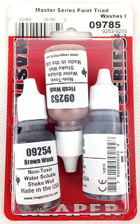

* Container: 15ml Dropper
* Cost per ml: $0.22/ml ($3.29 per dropper)
* Personal level of experience: High
* Washes in product line: 6
* Purchase: [Reaper Master Series Triad Washes I](https://amzn.to/2EPYT1k) (3 bottles for $11.25) with Brown, Black and Flesh

Reaper has a fairly limited line with Flesh, Brown, Black, Sepia, Stone and Steel.  That being said, they have the clearly very important ones of Flesh, Brown, Black and Sepia.  The Stone and Steel washes are fairly interesting, as there's nothing quite like them in other lines (Stone is a little similar to Vallejo's Grey Wash).  Steel wash is sort of a blue-grey and certainly has applications.  Reaper's washes get the job done.  I find them a step below the citadel washes, but it's only a minor step.  They are still plenty useful.  The primary probme here is that the wash range is really limited, so going with a set like that from Army painter or Vallejo is going to be a better experience just due to them having a much broader pallet.

## Tamiya Panel Line Accent Colors

* Container: 40ml jar with paint brush in lid
* Cost per ml: $0.23/ml (Around $9 per jar)
* Personal level of experience: Low 
* Washes in product line: 4

These are a special product.  They are used specifically for doing panel lineing which is for draing a dark accent around the edges of say a metal panel.  They are of more use to people doing sci-fi figures than fantasy.  These are frankly magic.  You dip the included brush and then poke it in between some panels and it will pull itself along the length of that line.  If you plan on doing panel lining, these are a super asset.
o

## Vallejo Game Color Washes

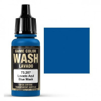

* Container: 18ml Dropper
* Cost per ml: $0.19/ml ($3.29 per dropper)
* Personal level of experience: High
* Washes in product line: 8
* Purchase: [Vallejo Game Color Wash Set](https://amzn.to/2ERnsuv) (8 washes for $21.95)

Vallejo washes were the first washes I branched out to from Reaper's.  I find they are fairly similar.  They are decent, but not as good as citadel or army painter.  As time goes on, I have become more frusterated with them, as I find the pigment seperating from the medium.  All this requires to fix is a good shake, but I don't have that issue with the citadel washes.  The line is fairly standard with one oddity: Grey.

The Vallejo range is Sepia, Black, Grey, Umber, Flesh, Green, Red and Blue.

## Vallejo Model Wash

#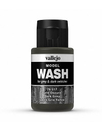

* Container: 35ml Dropper
* Cost per ml: $0.22/ml ($7.99 per dropper)
* Personal level of experience: Medium
* Washes in product line: 18
* Purchase: [Vallejo Dark Grey Model Wash](https://amzn.to/2WLdqoQ) ($7.99)

This wash is designed for models like vehicles.  The range is huge and has a fair number of colors that no other wash range has, including white.  The color range seems particularly focused around weathering.  I have only personally used one of these, Dark Grey on recommendation from Vince Ventrualla.  The dark grey model wash is super useful, in that it can be used more as a glaze to shade down an area.  Yes, you can use it as a wash, but for panel lining or glazing, this is a fantastic product.  At some point I will test some of the other washes in the line, but for miniature painting I can at least strongly recommend Vallejo Model Wash Dark Grey as a useful tool.

References:

* [Vince Venturella: Hobby Cheating 56 - Black Lining](https://www.youtube.com/watch?v=kl5GnGCw6Co)

## Warcolours Shades

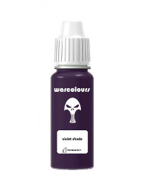

* Container: 15ml Dropper
* Cost per ml: $0.19/ml (2.50€ &#126; $2.81 per dropper)
* Personal level of experience: Low
* Washes in product line: 7
* Purchase: [Warclours Shade Set](https://www.warcolours.com/index.php?route=product/product&path=60&product_id=150) (7 shades for 17.45€ &#126; $19.62)

These are very matte, but also fairly thick shades.  They might work like other shades if thinned, but in their out of the bottle consistency, these can't be used like traditional shades.  I think these are probably better off used as a glaze than like a wash.  As I get more experience with them, I'll circle back and reevalate them.

## Other Wash lines

There are plenty of other lines of washes.  I'll keep a list here as I find them, and expand on them when I have a chance to try them out.

<!--
# To Be Added

* Inks

References:

* [Vince Venturella: Hobby Cheating 165 - Miniature Brand Ink & Shade Guide](https://www.youtube.com/watch?v=x01-3pTktas)

## Warcolours Inks

* [Vince Venturella: Product Review 24 - Warcolours Ink Set](https://www.youtube.com/watch?v=fXtwo-ZA7fQ)

## Scale 75 Inktensity

* [Vince Venturella: Product Review 03 - Scale 75 Inktensity](https://www.youtube.com/watch?v=RAntjX9-Ke8)

## Badger Minitare Ghost Tints

* [Vince Venturella: Hobby Cheating 32 - Ghost Tints & Candy Coats](https://www.youtube.com/watch?v=bBhufU9WHjE)

* Glazes

## Warcolours Glazes

* [Vince Venturella: Product Review 27 - Warcolours Glazes](https://www.youtube.com/watch?v=P9VzeS7_vfE)

* Additives

* [Vince Venturella: Hobby Cheating 135 - Guide to Paint Additives](https://www.youtube.com/watch?v=FuSFCiLvs1w)

* Dropper Bottles vs Paint Pots
* Pigment Density
* Finish
* Techniques
* Layering

* [Dr Faust's Painting Clinic: Painting Heroforge 2: Layering & Highlighting](https://www.youtube.com/watch?v=UNfjkVVtdIg)
* [Miniac: Episode 06: Layering](https://www.youtube.com/watch?v=dAcaBh_o6zI)
* [Miniac: Get the CREAMIEST Blends](https://www.youtube.com/watch?v=vAlDMGiHbX0)
* [Miniwargaming Jay: Miniature Painting 101 - Part 11 - Highlights](https://www.youtube.com/watch?v=lrnQMWDA_yA)
* [Miniwargaming Jay: Miniature Painting 101: Part 135 - Basics of Layering](https://www.youtube.com/watch?v=5rvHEI5Z8I0)

* Shading

* [Dr Faust's Painting Clinic: The Basics: Inks & Washes for Miniatures](https://www.youtube.com/watch?v=vuTCEzyZ50o)
* [Miniac: Episode 05: Shading](https://www.youtube.com/watch?v=EdbWckTKDmk)
* [Miniwargaming Jay: Miniature Painting 101 - Part 10 - Washes and Shades](https://www.youtube.com/watch?v=Ke2UMbMPN9w)
* [Miniwargaming Jay: Miniature Painting 101: Part 17 - Shading](https://www.youtube.com/watch?v=i7lBNjOVjLU)

* Wet Blending

* [Miniac: How to Wet Blend](https://www.youtube.com/watch?v=ERX3ghWvMDw)
* [Vince Venturella: Hobby Cheating 127 - How to Wet Blend](https://www.youtube.com/watch?v=tDppIYBhdv0)
* [Vince Venturella: Hobby Cheating 134 - How to Wet Blend Extreme Transitions](https://www.youtube.com/watch?v=gISsKIDYKGY)

* Two Brush Blending

* [Miniwargaming Jay: Miniature Painting 101: Part 47 - 2 Brush Blending](https://www.youtube.com/watch?v=g3xqTudA3C8)

* Loaded Brush

* [Vince Venturella: Hobby Cheating 12 - Layering and Loaded Brush](https://www.youtube.com/watch?v=7_04ZmOuucI)
* [Vince Venturella: Hobby Cheating 124 - Loaded Brush Blending](https://www.youtube.com/watch?v=TTmhmthvUOg)

* Drybrushing

* [Dr Faust's Painting Clinic: Drybrushing](https://www.youtube.com/watch?v=Tj9XNbwfwHo)
* [Dr Faust's Painting Clinic: Painting Heroforge 1: Drybrushing & Ink Washes](https://www.youtube.com/watch?v=eHhVqyYsz90)
* [Miniac: Episode 08: Drybrushing](https://www.youtube.com/watch?v=yqobfZiCJ2E)
* [Miniwargaming Jay: Miniature Painting 101 - Part 14 - Drybrushing](https://www.youtube.com/watch?v=QaEKiuCr7kg)
* [Vince Venturella: Hobby Cheating 139 Ultimate Guide to Drybrushing](https://www.youtube.com/watch?v=vHRMnJce4b8)

* Overbrushing

* [Miniwargaming Jay: Miniature Painting 101 - Part 15: Overbrushing](https://www.youtube.com/watch?v=cUnRvZGOars)

* Feathering

* [Miniwargaming Jay: Miniature Painting 101 - Part 16: Feathering](https://www.youtube.com/watch?v=inYHg3PSnnU)
* Edge Highlighting

* [Miniac: Episode 07: Edge Highlighting](https://www.youtube.com/watch?v=4uLi2QLaRlg)
* [Vince Venturella: Hobby Cheating 25 - Edge Highlighting](https://www.youtube.com/watch?v=PQhV_-pTtkM)
* [Vince Venturella: Hobby Cheating 125 - Edge Highlighting](https://www.youtube.com/watch?v=odBf2j5p-pQ)
* [Vince Venturella: Hobby Cheating 184 - How to Paint Difficult Edge Highlights](https://www.youtube.com/watch?v=pi8Pk2xGNOc)

* Glazing

* [Miniac: How to Glaze](https://www.youtube.com/watch?v=4ePwy9qED28)
* [Miniwargmaing Jay: Miniature Painting 101 - Part 12 - Glazes](https://www.youtube.com/watch?v=gzaxN4J69s0)
* [Miniwargaming Jay: Miniature Painting 101: Part 134 - Glazing](https://www.youtube.com/watch?v=DfJlGopB2Sg)
* [Vince Venturella: Hobby Cheating 02 - Undershading & Glazes](https://www.youtube.com/watch?v=4ZFXSE9UHUM)
* [Vince Venturella: Hobby Cheating 10 - Technique Tips - Washes, Glazes & Drybrush](https://www.youtube.com/watch?v=qaARYpmCyC4)
* [Vince Venturella: Hobby Cheating 31 - Blending - Glazes, Two Brush, Feathering & Loaded Brush](https://www.youtube.com/watch?v=70A3_bHGMGc)
* [Vince Venturella: Hobby Cheating 122 - How to Glaze](https://www.youtube.com/watch?v=N88NtHNmz1Q)

* Zenithal Priming + Glazing

* [Ghool's Painting Tips: Speed Painting - Zenithal Prime and Glazing](https://www.youtube.com/watch?v=SvJjD6Hm1Es)
* [Miniac: Speedpaint Minis Without Losing Quality!](https://www.youtube.com/watch?v=vGOmSKO_KaU)
* [Sorastro's Blood Rage Painting Guide Ep.1: The Frost Giant](https://www.youtube.com/watch?v=RtHbIfyQHBU)
* [Tabletop Minons: Understanding Underpainting](https://www.youtube.com/watch?v=Wxc9WX2INp4)
* [Vince Venturella: Hobby Cheating 07 - Zenithal Highlighting & Ghosts](https://www.youtube.com/watch?v=1nDvWs4dsfc)
* [Vince Venturella: Hobby Cheating 11 - Zenithal Highlighting Next Steps](https://www.youtube.com/watch?v=hCafLRStALA)
* [Vince Venturella: Hobby Cheating 74 - Speed Painting with Washes, Shades & Inks](https://www.youtube.com/watch?v=1YdY7GlwKQc)
* [Vince Venturella: Hobby Cheating 75 - Zenithal Highlighting and Glazes](https://www.youtube.com/watch?v=J-dQU-dSNa8)
* [Vince Venturella: Hobby Cheating 104 - Zenithal Speed Painting w True Metals](https://www.youtube.com/watch?v=ByX2jIEmXJM)
* [Vince Venturella: Hobby Cheating 105 - Zenithal Speed Painting Gold True Metals](https://www.youtube.com/watch?v=agRmMwuQI5A)
* [Vince Venturella: Hobby Cheating 123 - Warm Zenithal Highlighting](https://www.youtube.com/watch?v=rFDHpVJiNC0)
* [Vince Venturella: Hobby Cheating 136 - Guide to Value Sketching](https://www.youtube.com/watch?v=n0CFC2soR18)
* [Vince Venturella: Hobby Cheating 175 - Understanding Unusual Undershading & Zenithal Highlighting](https://www.youtube.com/watch?v=Doc2GdL2Lv4)
-->
